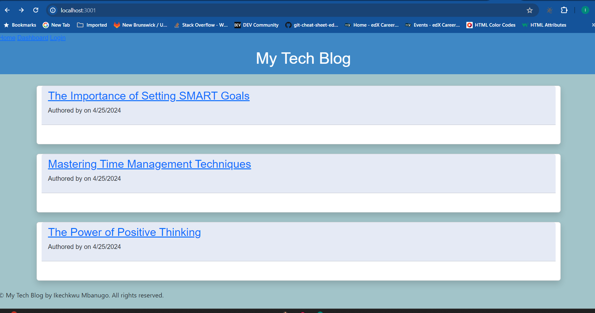

### My Tech Blog

#### Description:
My Tech Blog is a platform where users can share their thoughts, experiences, and insights on various topics related to technology. It provides a space for tech enthusiasts, professionals, and hobbyists to engage in discussions, share knowledge, and stay updated with the latest trends in the tech industry.

#### URL:
The live version of My Tech Blog can be accessed at [https://www.mytechblog.com](https://www.mytechblog.com)

#### Recording:
Currently, there is no recording available for My Tech Blog.

#### Images:

*Screenshot of the homepage of My Tech Blog*


*Screenshot of the dashboard page of My Tech Blog*

#### Technologies Used:
- **Frontend**:
  - HTML5
  - CSS3
  - JavaScript
  - Bootstrap
  
- **Backend**:
  - Node.js
  - Express.js
  
- **Database**:
  - MySQL
  
- **View Engine**:
  - Handlebars.js
  
- **ORM**:
  - Sequelize
  
- **Session Management**:
  - Express Session
  
- **Deployment**:
  - Heroku
  
- **Version Control**:
  - Git
  
- **Other Tools**:
  - VS Code
  - Git Bash

#### Installation:
1. Clone the repository:
   ```
   git clone https://github.com/imbanu1/my-tech-blog.git
   ```
2. Navigate to the project directory:
   ```
   cd my-tech-blog
   ```
3. Install dependencies:
   ```
   npm install
   ```
4. Set up the database:
   - Create a MySQL database and configure the connection in `config/connection.js`.
   - Run the Sequelize migration to create the necessary tables:
     ```
     npx sequelize db:migrate
     ```

#### Usage:
1. Start the server:
   ```
   npm start
   ```
2. Open a web browser and navigate to `http://localhost:3001` to access the application.
3. Register an account or log in if you already have an account.
4. Explore the blog posts, create new posts, comment on existing posts, and interact with other users.

#### Contribution:
Contributions are welcome! If you'd like to contribute to My Tech Blog, please fork the repository, make your changes, and submit a pull request.

#### License:
This project is licensed under the [MIT License](LICENSE).

#### Contact:
For any inquiries or feedback, please contact [Ikechukwu Mbanugo](mailto:imbanu1@gmail.com).

---
Feel free to customize the README according to your project's specifics and add any additional sections as needed.